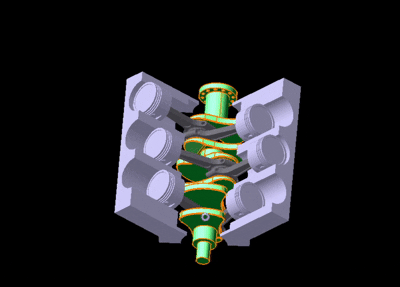
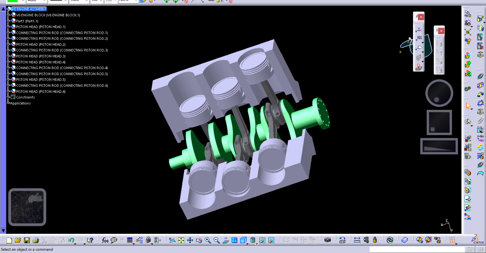

# V6 Engine – 3D CAD Design & Kinematic Simulation (CATIA V5)

### 🔧 Complete 3D Mechanical Design | 🛠️ Fully Assembled Engine | 🎥 Kinematic Simulation | 📌 CATIA V5

This repository showcases a fully-designed **V6 internal combustion engine** modeled in **CATIA V5**, including the **pistons, crankshaft, connecting rods, engine block**, and all associated components. The project demonstrates expertise in **CAD modeling, mechanical assembly, kinematic simulation, and design for motion systems**, relevant for roles in **aerospace, automotive, and core mechanical engineering**.

---

## 📌 Project Overview

This project represents the complete mechanical build-up of a V6 engine, designed and animated in CATIA V5:

* ✔️ 3D modelling of all engine components
* ✔️ Complete product structure & mechanical assembly
* ✔️ Fully functional **kinematic simulation** of piston–crank mechanism
* ✔️ Design intent maintained through geometric constraints
* ✔️ Demonstrates understanding of **mechanisms, tolerances, and fits**
* ✔️ Includes **CATPart** and **CATProduct** files

---

## 📁 Directory Structure

```
📦 V6-Engine-CATIA-Project
 ├── CONNECTED PISTON ROD.CATProduct
 ├── connecting rod.CATPart
 ├── Crank_shaft.CATPart
 ├── PISTON HEAD.CATPart
 ├── PISTON PIN.CATPart
 ├── ROD CAP.CATPart
 ├── V6 ENGINE BLOCK full.CATPart
 ├── V6 ENGINE BLOCK cut.CATPart
 ├── V6 ENGINE ASSEMBLY.CATProduct
 ├── SU-57 (extra model).CATProduct
 ├── Part1–Part8 (supporting subparts)
 └── Kinematic Simulation (DMU Kinematics)
```

---

## 🛠️ Tools & Technologies

| Technology             | Usage                                              |
| ---------------------- | -------------------------------------------------- |
| **CATIA V5**           | 3D CAD modeling, assembly, constraints             |
| **DMU Kinematics**     | Motion simulation of crank–slider mechanism        |
| **Part Design**        | Pistons, crankshaft, connecting rods, engine block |
| **Assembly Design**    | V6 configuration, constraints & degrees of freedom |
| **Mechanism Analysis** | Kinematic relationships, motion validation         |

---

## 🚀 Key Features

### 1️⃣ Fully Modelled V6 Engine Block

* Cylinder arrangement, crankcase, ribbing structure

### 2️⃣ Detailed Crankshaft & Connecting Rods

* Accurate crank throws for V6 configuration
* Balanced geometry for smooth motion

### 3️⃣ Piston Assembly

* Piston head
* Piston pin
* Connecting rod
* Rod cap

### 4️⃣ Complete Engine Assembly

* All parts precisely constrained
* Proper mechanical degrees of freedom retained

### 5️⃣ Kinematic Simulation

* Realistic piston reciprocation
* Crankshaft-driven slider–crank mechanism
* Smooth and synchronized motion

---

## 🎥 Kinematic Motion (Simulation)

The engine working cycle is animated using **CATIA DMU Kinematics**:

* Crankshaft rotation drives six pistons
* Motion validation through mechanism joints
* Demonstrates practical understanding of engine dynamics




---

## 📸 Screenshots




---

## 📚 Learning Outcomes

This project demonstrates knowledge of:

* 3D mechanical modeling
* Kinematic linkage design
* Assembly constraint management
* Motion simulation in CATIA
* Real-world engine geometry & dynamics

---

## 📌 Applications

Relevant for roles in:

* Mechanical engineering & design
* Automotive engine development
* Aerospace mechanical systems
* CAD/CAE roles (CATIA, SolidWorks, NX)
* Manufacturing & assembly engineering

---

## 💼 About the Designer

**Harsh Ingle**
Aerospace & Mechanical Engineering
Specialized in:

* CAD Modeling (CATIA V5, SolidWorks, Fusion 360)
* Mechanical and Kinematic Systems
* Engine & Propulsion Mechanism Modeling
* Design, Simulation & Manufacturing Concepts

---

## 📬 Contact

**ingleharsh24@gmail.com** *Add your email here*


---

* A **video thumbnail** for your engine animation
* A polished **GitHub profile README** matching this design
